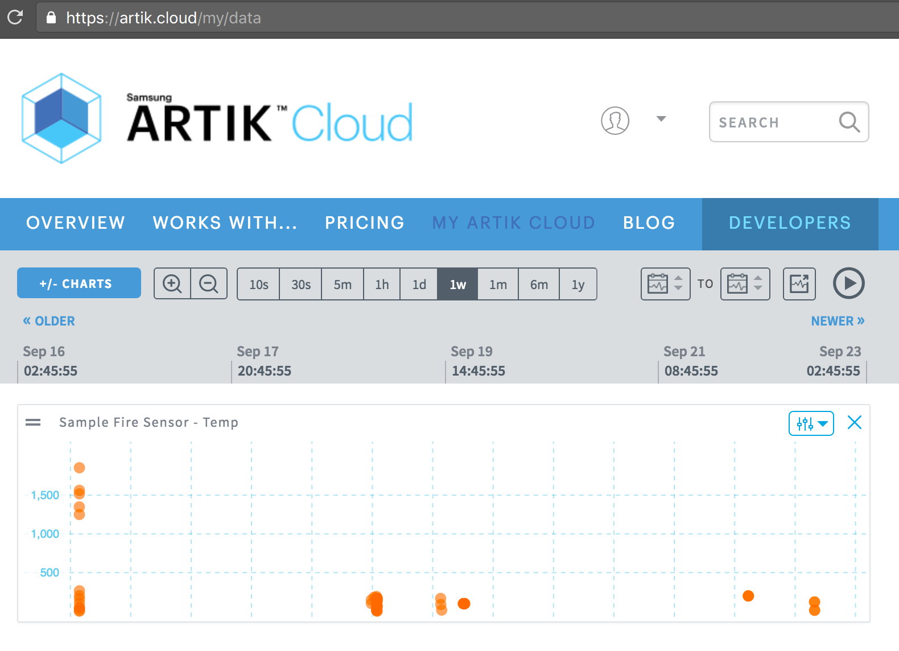

# ARTIK Cloud Javascript SDK starter code

This is a Node.js sample code to send and get a message to and from ARTIK Cloud using the [ARTIK Cloud Javascript SDK](https://github.com/artikcloud/artikcloud-js)

### Prerequisites
* [Node.js](https://nodejs.org/en/) 
* [npm](https://www.npmjs.com/get-npm) (Installed with Node.js)
* [ARTIK Cloud Javascript SDK](https://github.com/artikcloud/artikcloud-js)

### Setup / Installation:

Check you have Node.js installed:

```
node -v
```

Check you have npm installed:

```
npm -v
```

Setup ARTIK Cloud:

  1. Sign into [My ARTIK Cloud](https://artik.cloud/)
  2. [Connect a new device](https://my.artik.cloud/new_device/cloud.artik.sample.demofiresensor?device_name=Demo+Fire+Sensor) by adding the [Demo Fire Sensor](https://my.artik.cloud/new_device/cloud.artik.sample.demofiresensor?device_name=Demo+Fire+Sensor) into your account.
  3. Click the Settings icon of the device you just added.  Note the **device ID** and **device token** for later. Click "Generate Device Token" if needed.


Setup Code:

  1. Add your **device ID** and **device token** to the config.json file.
  2. Install the artikcloud-js library by typing the following command:

 ```javascript
 npm install artikcloud-js --save
 ```


## Run the code

Run `send-message.js` file to send a message to your device.   This will send a random temperature value to ARTIK Cloud on behalf of the device.  

```javascript
%> node send-message.js

> Making API call with data: 
{"data":{"temp":"50.4"},"sdid":"a12345f ..."}
```

If sending goes well, you receive a response with a message id (mid).   ARTIK Cloud uses this response to acknowledge the receipt of the message as shown below.

```javascript
// < API Response:
{ 
  "data": {
    "mid": "a9b4982c708540cd9742adddef902c15"
  }
}
```

Run `get-message.js` to get the last message sent to your device.


```javascript
%> node get-message.js

> Making API call with data:
{"count":1,"sdids":"a12345f ..."}
```

```javascript
// < API Response:
{ 
  "count": 1,
  "size": 1,
  "data": [
    {
      "cts": 1503943447709,
      "ts": 1503943447709,
      "mid": "1df4e2e2784e48b1a225892e574fe12e",
      "sdid": "a12345f ... ",
      "sdtid": "dt856e54302a294fba80414b87eb7b79a3",
      "uid": "u12345f ... ",
      "mv": 1,
      "data": {
        "temp": 10
      }
    }
  ],
  "sdids": "a12345f ... "
}
```

Note above there is a **temp** value that was sent to the device earlier.


## View your data in My ARTIK Cloud

Have you visited ARTIK Cloud [data visualization tool](https://artik.cloud/my/data)?  Select your device from the charts to view your device data in realtime. 



## More examples

- Visit our [code samples](https://developer.artik.cloud/documentation/tutorials/code-samples/) for more examples.
- Visit our [REST Documentation](https://developer.artik.cloud/documentation/api-reference/rest-api.html) for [Send Message](https://developer.artik.cloud/documentation/api-reference/rest-api.html#post-a-message-or-action) and [Get Message API](https://developer.artik.cloud/documentation/api-reference/rest-api.html#get-last-normalized-messages) calls.
 - Visit the [ARTIK Cloud Javascript SDK](https://github.com/artikcloud/artikcloud-js) for sample code snips.


More about ARTIK Cloud
---------------

If you are not familiar with ARTIK Cloud, we have extensive documentation at https://developer.artik.cloud/documentation

The full ARTIK Cloud API specification can be found at https://developer.artik.cloud/documentation/api-reference/

Peek into advanced sample applications at https://developer.artik.cloud/documentation/samples/

To create and manage your services and devices on ARTIK Cloud, visit the Developer Dashboard at https://developer.artik.cloud

License and Copyright
---------------------

Licensed under the Apache License. See [LICENSE](LICENSE).

Copyright (c) 2017 Samsung Electronics Co., Ltd.
