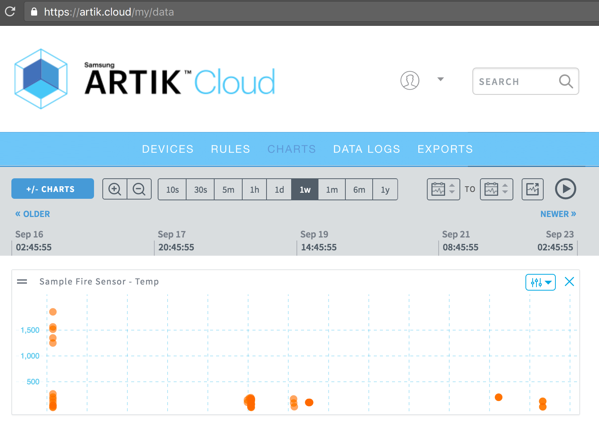

# ARTIK Cloud Javascript SDK starter code

This is a Node.js sample code to send and get a message to and from ARTIK Cloud using the [ARTIK Cloud Javascript SDK](https://github.com/artikcloud/artikcloud-js)

## Requirements
* [Node.js](https://nodejs.org/en/) 
* [npm](https://www.npmjs.com/get-npm) (Installed with Node.js)
* [ARTIK Cloud Javascript SDK](https://github.com/artikcloud/artikcloud-js)

Run the following commands to make check Node.js and npm are installed:

```
$ node -v
v6.5.0
```

```
$ npm -v
3.10.3
```

## Setup

#### **Setup at ARTIK Cloud:**

1. Sign into [My ARTIK Cloud](https://artik.cloud/)
2. [Connect a new device](https://my.artik.cloud/new_device/cloud.artik.sample.demofiresensor?device_name=Demo+Fire+Sensor) and add the [Demo Fire Sensor](https://my.artik.cloud/new_device/cloud.artik.sample.demofiresensor?device_name=Demo+Fire+Sensor) into your account.
3. Click the Settings icon of the device you just added.  Note the **device ID** and **device token** for later. Click "Generate Device Token" if needed.


#### **Setup project**:

Before running the sample, fill in the following into your the `config.json` file:

```son
{
    "device_id": "YOUR_DEVICE_ID",
    "device_token": "YOUR_DEVICE_TOKEN"
}
```

#### **Install dependencies:**

 ```javascript
$ npm install artikcloud-js --save
 ```

#### **Run project:**

```
$ node send-message.js
```

## Demo

#### 1. Send a message

   Run `send-message.js` to send a message to ARTIK Cloud from the device.   In this sample, each message will send a random temperature value.

```javascript
$ node send-message.js

> Making API call with data: 
{"data":{"temp":"50.4"},"sdid":"a12345f ..."}
```

If sending goes well, you receive a response with a message id (mid).   ARTIK Cloud uses this response to acknowledge the receipt of the message as shown below.

```javascript
{ "data": { "mid": "a9b4982c708540cd9742adddef902c15"}}
```

#### 2. Get a message

   Run `get-message.js` to get the last message sent by your device.


```javascript
$ node get-message.js

> Making API call with data:
{"count":1,"sdids":"a12345f ..."}
```

Below is the response. It has a 'temp' value of 50.4 that was sent earlier.


```javascript
{ 
  "count": 1,
  "size": 1,
  "data": [
    {
      "cts": 1503943447709,
      "ts": 1503943447709,
      "mid": "1df4e2e2784e48b1a225892e574fe12e",
      "sdid": "a12345f ... ",
      "sdtid": "dt856e54302a294fba80414b87eb7b79a3",
      "uid": "u12345f ... ",
      "mv": 1,
      "data": {
        "temp": 50.4
      }
    }
  ],
  "sdids": "a12345f ... "
}
```


#### 3. View your data in My ARTIK Cloud

- Visit the [Data Logs](https://my.artik.cloud/messages) in your user dashboard at https://my.artik.cloud
- Visit the [Charts](https://my.artik.cloud/data) in your user dashboard at https://my.artik.cloud



## More examples

- Visit our [code samples](https://developer.artik.cloud/documentation/tutorials/code-samples/) for more examples.
- Visit our [REST Documentation](https://developer.artik.cloud/documentation/api-reference/rest-api.html) for [Send Message](https://developer.artik.cloud/documentation/api-reference/rest-api.html#post-a-message-or-action) and [Get Message API](https://developer.artik.cloud/documentation/api-reference/rest-api.html#get-last-normalized-messages) calls.
 - Visit the [ARTIK Cloud Javascript SDK](https://github.com/artikcloud/artikcloud-js) for sample code snips.


More about ARTIK Cloud
---------------

If you are not familiar with ARTIK Cloud, we have extensive documentation at https://developer.artik.cloud/documentation

The full ARTIK Cloud API specification can be found at https://developer.artik.cloud/documentation/api-reference/

Peek into advanced sample applications at [https://developer.artik.cloud/documentation/tutorials/code-samples](https://developer.artik.cloud/documentation/tutorials/code-samples/)

To create and manage your services and devices on ARTIK Cloud, visit the Developer Dashboard at https://developer.artik.cloud

License and Copyright
---------------------

Licensed under the Apache License. See [LICENSE](LICENSE).

Copyright (c) 2017 Samsung Electronics Co., Ltd.
